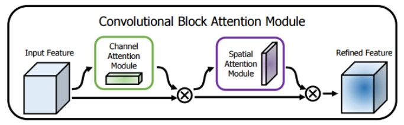
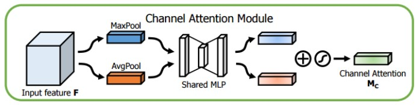
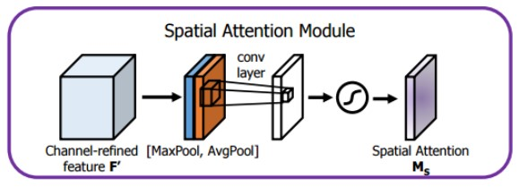

# CBAM: Convolutional Block Attention Module (PyTorch)
## Abstract
CBAM, a simple yet effective attention module for feed-forward convolutional neural networks. It is a lightweight and general module that can be integrated into any CNN architectures seamlessly and is end-to-end trainable along with base CNNs. CBAM is used to increase representation power by using attention mechanism: focusing on important features and suppressing unnecessary ones. To achieve this, we sequentially apply channel and spatial attention modules so that each of the branches can learn 'what' and 'where' to attend in the channel and spatial axes respectively.
<p align="center">
  
</p>

```py
class CBAM(nn.Module):
    def __init__(self, channels, r):
        super(CBAM, self).__init__()
        self.channels = channels
        self.r = r
        self.sam = SAM(bias=False)
        self.cam = CAM(channels=self.channels, r=self.r)

    def forward(self, x):
        output = self.cam(x)
        output = self.sam(output)
        return output + x
  ````

## Channel Attention Module (CAM)
CAM generate a channel attention map by exploiting the inter-channel relationship of features. As each channel of a feature map is considered as a feature detector, channel attention focuses on 'what' is meaningful given an input image. 
<p align="center">
  
</p>

```py
class CAM(nn.Module):
    def __init__(self, channels, r):
        super(CAM, self).__init__()
        self.channels = channels
        self.r = r
        self.linear_max = nn.Sequential(
            nn.Linear(in_features=self.channels, out_features=self.channels//self.r, bias=True),
            nn.ReLU(inplace=True),
            nn.Linear(in_features=self.channels//self.r, out_features=self.channels, bias=True))
        self.linear_avg = nn.Sequential(
            nn.Linear(in_features=self.channels, out_features=self.channels//self.r, bias=True),
            nn.ReLU(inplace=True),
            nn.Linear(in_features=self.channels//self.r, out_features=self.channels, bias=True))

    def forward(self, x):
        max = F.adaptive_max_pool2d(x, output_size=1)
        avg = F.adaptive_avg_pool2d(x, output_size=1)
        b, c, _, _ = x.size()
        linear_max = self.linear_max(max.view(b,c)).view(b, c, 1, 1)
        linear_avg = self.linear_avg(avg.view(b,c)).view(b, c, 1, 1)
        output = linear_max + linear_avg
        output = F.sigmoid(output) * x
        return output
```

## Spatial Attention Module (SAM)
SAM generate a spatial attention map by utilizing the inter-spatial relationship of features. Different from the channel attention, the spatial attention focuses on 'where' is an informative part, which is complementary to the channel attention.
<p align="center">
  
</p>

```py
class SAM(nn.Module):
    def __init__(self, bias=False):
        super(SAM, self).__init__()
        self.bias = bias
        self.conv = nn.Conv2d(in_channels=2, out_channels=1, kernel_size=7, stride=1, padding=3, dilation=1, bias=self.bias)

    def forward(self, x):
        max = torch.max(x,1)[0].unsqueeze(1)
        avg = torch.mean(x,1).unsqueeze(1)
        concat = torch.cat((max,avg), dim=1)
        output = self.conv(concat)
        output = output * x 
        return output 
```

## Results - VGG19 (CIFAR100)
Evaluated CBAM using VGG19 model with BatchNorm on CIFAR100 dataset.  
The configurations used to train VGG:
* Adam Optimizer
* 0.0001 Learning Rate
* 0.005 Weight Decay
* Cross Entropy Loss
* 50 Epochs

| Model | Top-1 Acc | Top-5 Acc |
| ----- | --------- | --------- |
| VGG19 | 39.08% | 66.56% |
| VGG19 + CBAM [^1] | 40.26% | 68.30% |

[^1]: Reduction ratio of 8 was used during training

--- 
More detailed information can be seen using the link down below:  
[https://arxiv.org/abs/1807.06521](https://arxiv.org/abs/1807.06521)
